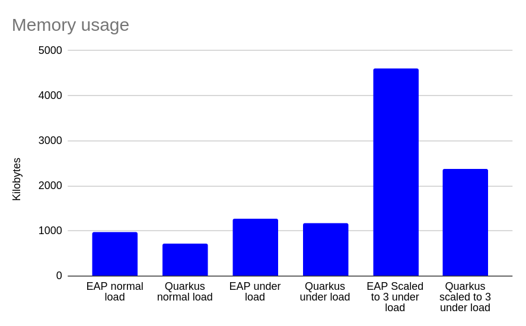
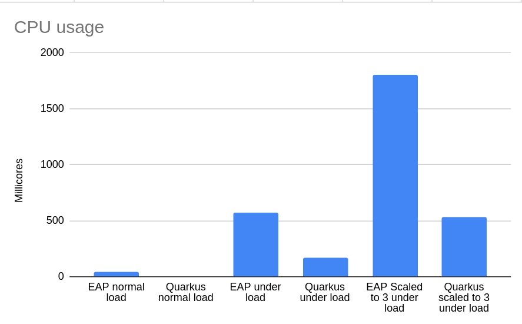

# Monolith vs Microservices comparison

This repo contains two versions of the Red Hat Coolstore application. 

* A monolith application running on JBoss EAP
* A Microservices application consisting of the following
    * A Quarkus Inventory application
    * A Quarkus Catalog application
    * A Quarkus Cart application
    * A Quarkus Orders application
    * A Node.js frontend UI.

## Deployment

Each version of the Coolstore application is deployed in OpenShift as follows:

### Monolith

Components:
* AMQ Broker instance:
    * JBoss EAP in OpenShift does not include embedded messaging functionality.  Best practice for EAP on OpenShift is to use external message queue i.e. AMQ Broker (included in Runtimes and RHAF subscriptions)
* PostgreSQL database:
    * Used by the Coolstore EAP application to persist data
* EAP8 application:
    * Coolstore monolith application deployed using the JBoss EAP OpenShift operator

[Instructions to deploy the monolith application](./monolith.md 'Monolith deployment')

### Microservices

Components:
* Coolstore application:
    * A Node-js application serving the Coolstore web frontend
* Orders application:
    * Quarkus microservice providing order management functionality
    * MongoDB database for persisting orders data
* Catalog application:
    * Quarkus microservice providing catalog management functionality
    * PostrgreSQL database for persisting catalog data
* Inventory application:
    * Quarkus microservice providing inventory management functionality
    * PostrgreSQL database for persisting inventory data
* Cart application:
    * Quarkus microservice providing cart management functionality
    * Datagrid service providing state management for cart data

[Instructions to deploy the microservices application](./microservices.md 'Microservices deployment')

## Load testing

To perform load testing we'll use Apache JMeter. JMeter can be downloaded from [here](https://jmeter.apache.org/download_jmeter.cgi)

This repo contains two JMeter test plans

* quarkus.jmx, a test plan to test the Microservices application
* eap.jmx, a test plan to test the monolith application

To run these test plans, open the files in JMeter and edit the url to match the url of your OpenShift cluster.

Edit the thread groups configuration to configure the number of users to simulate.

Click on the "play" button to run the tests.

## Results

### Boot time	
Measuring time to ready to accept connections

Monolith:
* JBoss EAP 8 application: 50 seconds

Microservices:
* Cart: 2 seconds
* Catalog: 10 seconds
* Coolstore-ui: 2 seconds
* Inventory: 10 seconds
* Order: 2 seconds

### Resource usage

Resource usage measuring the entire footprint of the OpenShift namespace containing all the components required to support each application, e.g. database instances, deployed applications, message queue instances.

The resource usage was measured three times. 
* Under normal load, single instance of each application
* Under load, single instance of each application
* Under load, scaled to 3 instances of each application

#### Memory consumption

#### CPU utilization

### Transactions per second

This chart shows the transactions per second when under load from JMeter test simulating 1000 users, 3 requests per session, 100 sessions.  Total 300,000 RESTful calls.

The test was performed twice per application. The first time there was a single instance of the application, the second time the application was scaled to 3 instances.  In the case of the microservices application the Catalog and Cart services are scaled to three instances

